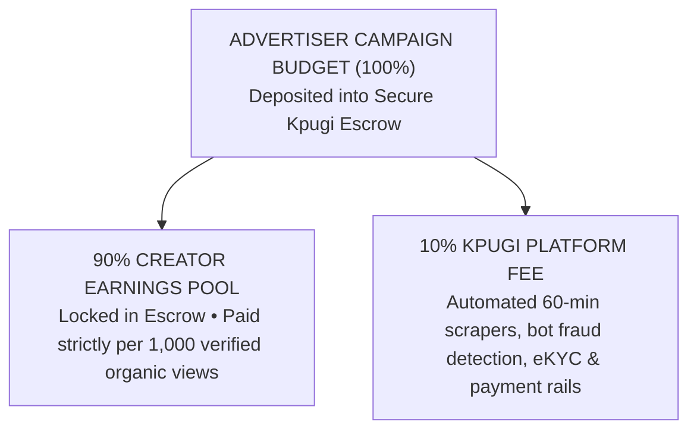

# Kpugi Brand & Advertiser Operating Rules, Campaign Compliance & Escrow Standards

**Document Identifier:** `KPG-BR-COMPLIANCE-V2.4`  
**Effective Date:** September 2026  
**Audience:** All Registered Brands, Advertisers, Marketing Agencies, and Corporate Partners on Kpugi  
**Jurisdiction & Governing Law:** Federal Republic of Nigeria (FCCPC, ARCON, CBN, NITDA) & International Advertising Standards  
**Official Portal:** [https://support.kpugi.com](https://support.kpugi.com)

---

## 1. Executive Summary & The Verified Performance Advertising Standard

Kpugi is Nigeria’s first performance-driven creator ad platform. We operate on a foundational promise: **Brands only pay for real, human, verified organic views.**

Traditional influencer marketing in emerging markets suffers from high financial risk, opaque follower metrics, unverified view counts, and upfront talent retainers with zero accountability. Kpugi solves this by replacing vanity metrics with an **automated escrow and algorithmic view-auditing engine**:

1. **100% Escrow Protection:** 100% of the advertiser's campaign budget is locked safely in automated escrow before any creator can claim a slot or publish content.
2. **The 1,000-View Hard Cliff:** Creators earn ₦0.00 until their post crosses 1,000 verified organic views. If a video fails to reach 1,000 views, the brand is charged ₦0.00, and the escrow funds remain the advertiser's property.
3. **Automated 60-Minute Scraper Audits:** Our server-side scrapers monitor live posts every 60 minutes across TikTok, Instagram Reels, YouTube Shorts, and X (Twitter) for view velocity, retention, and authenticity.
4. **Anti-Bot & Anti-Fraud Shield:** Unnatural bot clusters, click farms, private videos, and deleted posts are automatically intercepted, scrubbed, and disqualified before touching brand capital.
5. **Brief as a Binding Contract:** Once published, the advertiser's campaign brief constitutes an enforceable Service Level Agreement (SLA). Creators must strictly comply with all mandatory guidelines to qualify for payout.

This document serves as the **supreme operational, legal, and financial source of truth** for all brands and advertisers operating on Kpugi.

---

## 2. Advertiser Onboarding, Corporate Identity & KYB Standards

To maintain an ecosystem of reputable commercial campaigns and protect consumers and creators, Kpugi enforces strict Know-Your-Business (KYB) and corporate verification standards.

### 2.1 Corporate Eligibility
The following entities are eligible to advertise on Kpugi:
- **Registered Corporate Entities:** Duly registered companies with the Corporate Affairs Commission (CAC) in Nigeria or equivalent foreign corporate registries.
- **Duly Registered Businesses & Enterprises:** Sole proprietorships, partnerships, and registered business names.
- **Advertising & Digital Marketing Agencies:** Agencies managing campaigns on behalf of third-party client brands.
- **Verified Independent Brands:** Early-stage startups, eCommerce merchants, and solo entrepreneurs who complete identity verification.

### 2.2 Account Information Requirements
When registering an Advertiser Profile, brands must provide:
1. **Official Legal Business / Trading Name.**
2. **Valid Corporate Email Address** (generic disposable or free webmail domains may be subject to additional verification).
3. **Tax Identification Number (TIN) or CAC Registration Number** (for Nigerian businesses).
4. **Active Business Website or Verifiable Social Presence.**
5. **Designated Corporate Representative:** Full name and direct phone number of the authorized campaign manager.

### 2.3 Account Security & Dual-Role Separation
- **Dual-Role Separation:** User accounts on Kpugi are partitioned into Creator Profiles and Advertiser Profiles. Advertisers who also wish to post content as creators must maintain distinct operational profiles.
- **Credentials & API Access:** Advertisers are solely responsible for all campaign launches, budget commitments, and brief approvals executed under their credentials.

---

## 3. Campaign Economics, Budget Escrow & Fee Structure

Kpugi operates on a transparent, mathematical Cost-Per-Mille (CPM) pricing model backed by 100% escrow pre-funding.

### 3.1 CPM Pricing Structure
- **Cost-Per-Mille (CPM):** The cost per 1,000 verified views.
- **Minimum CPM Floor:** ₦2,000 per 1,000 views (equivalent to ₦2.00 per verified view).
- **Preset Recommended CPM Rates:** ₦2,000 | ₦2,500 | ₦3,500 | ₦5,000 | ₦7,500 | ₦10,000+ per 1,000 views. Higher CPM rates attract top-tier creators with higher engagement velocity.

### 3.2 Campaign Budget Minimums & Caps
- **Minimum Campaign Budget:** ₦10,000 (Recommended starter budget: ₦25,000 to ₦100,000; Enterprise scale: ₦500,000 to ₦10,000,000+).
- **Budget Cap Enforcement:** When the total verified views across all participating creators reach the allocated campaign budget, the campaign is automatically paused. **Advertisers will never be billed for views exceeding their configured budget cap.**
- **Featured Campaign Add-On:** Brands may opt for a "Featured Campaign" placement (₦2,500 flat fee) to pin the brief at the top of the Creator Browse feed and send high-priority push notifications to verified creators.

### 3.3 The 90 / 10 Revenue Allocation Model
Every Naira deposited into a campaign budget is distributed according to our verified performance split:
- **90% Creator Earnings Pool:** Held in escrow and disbursed directly to creators who deliver verified views exceeding the 1,000-view threshold.
- **10% Kpugi Platform Fee:** Covers automated 60-minute scraping infrastructure, bot fraud detection, eKYC verification, server hosting, customer support, and Paystack banking rails.

> **Escrow Allocation Summary:**
> - **100% Campaign Deposit:** Held securely in automated Kpugi Escrow upon launch.
>   - **90% Creator Earnings Pool:** Reserved in escrow and paid out strictly per 1,000 verified organic views.
>   - **10% Kpugi Platform Fee:** Covers automated 60-minute scrapers, anti-fraud detection, Didit eKYC, and Paystack banking rails.

### 3.4 Escrow Funding Channels
Advertisers can fund their Kpugi Wallet or direct campaign checkout via:
1. **Paystack Gateway:** Instant funding via Debit/Credit Cards (Mastercard, Visa, Verve), Bank Transfers, USSD, and Apple Pay.
2. **Kpugi Brand Wallet:** Pre-funded account balance allowing instant 1-click campaign launches without re-entering payment cards.
3. **Corporate Direct Invoicing & Wire Transfers:** Available for enterprise accounts committing budgets of ₦1,000,000 and above.

### 3.5 Unspent Escrow Balances & Refund Policy
- **Absolute Ownership of Funds:** Unspent escrow capital remains 100% the property of the advertiser at all times.
- **Unclaimed & Incomplete Budgets:** If a campaign concludes or is manually archived before the total budget is spent by creators, the remaining balance is immediately unlocked and credited back to the Brand Wallet.
- **Bank Refund Processing:** Advertisers may request a full bank refund of their unspent Brand Wallet balance at any time. Refunds are processed back to the original funding bank account via Paystack within **3 to 5 business days**.

---

## 4. Campaign Brief Construction & Contractual Enforceability

The campaign brief is the legal and operational foundation of each campaign. Once published to the creator marketplace, it governs the acceptance, execution, and audit criteria for all creator submissions.

### 4.1 Mandatory Brief Elements
Every campaign launched on Kpugi must contain:
1. **Campaign Title:** Punchy, descriptive headline (3 to 8 words) summarizing the offer or campaign objective.
2. **Primary Campaign Objective:** Specific outcome desired (e.g., App Downloads, Brand Awareness, Lead Generation, Event Promotion, Product Review).
3. **Clear Creative Brief & Description:** Comprehensive instructions detailing the messaging, product features, storyline, or presentation style.
4. **Mandatory Talking Points & Value Propositions:** 2 to 4 key brand benefits that creators must articulate or display.
5. **Specific Do's & Don'ts:** Clear operational boundaries (e.g., "Do showcase app dashboard", "Don't mention competitor X", "Don't play background copyrighted music").
6. **Required Disclosure & Brand Tags:**
   - Mandatory ad disclosures: `#KpugiAd`, `#Sponsored`, or `#Ad`.
   - Official brand handle tag (e.g., `@YourBrandName`).
   - Official campaign hashtags (e.g., `#YourCampaignTag`).
7. **Cloud Asset Links (Optional but Recommended):** Direct links to high-resolution brand logos, raw video footage, product photos, or audio scripts via Google Drive, Dropbox, or OneDrive.

### 4.2 Non-Retroactive Brief Rule (The "Freeze Rule")
To guarantee fairness and prevent abuse of creators:
- **No Retroactive Alterations:** Once a creator has claimed a campaign slot and submitted a live post URL, the advertiser **cannot** add new mandatory requirements, alter required hashtags, or modify talking points for that submission.
- **Clarity Obligation:** If a brand brief is ambiguous, Kpugi’s compliance desk will interpret the brief in favor of reasonable, good-faith creator execution.
- **Updating Live Briefs:** Advertisers may update brief details for *future* submissions. Any updates apply solely to creators who claim slots *after* the timestamp of the update.

### 4.3 AI Brief Polish & Quality Standards
Advertisers may utilize Kpugi’s built-in **NVIDIA NIM AI Brief Assistant** to polish campaign titles, expand briefings into clear Do's & Don'ts, and generate optimized hashtags. Advertisers remain fully responsible for reviewing and confirming all AI-generated copy prior to publication.

---

## 5. Prohibited & Restricted Advertising Categories (Zero-Tolerance Policy)

Kpugi maintains strict advertising standards to safeguard Nigerian consumers, protect platform integrity, and comply with federal regulations.

### 5.1 Strictly Prohibited Categories (Immediate Blacklist & Escrow Forfeiture)
Advertisers may **not** promote, launch campaigns for, or reference any of the following:

| Category | Prohibited Items & Activities |
| :--- | :--- |
| **Financial Fraud & Scams** | Ponzi schemes, unlicensed High-Yield Investment Programs (HYIP), crypto "pump-and-dump" tokens, multi-level marketing (MLM) pyramid schemes, fake forex robots, "get-rich-quick" schemes, and unregistered investment syndicates. |
| **Predatory Lending & Illegal Loan Apps** | Unregistered digital money lenders (DMLs) that violate FCCPC guidelines, platforms that engage in defamatory debt-collection harassment, contact list scraping, or usurious interest rates. |
| **Unlicensed Gambling & Sports Betting** | Any betting site, online casino, lottery, or gambling scheme lacking valid licensing from the National Lottery Regulatory Commission (NLRC) or relevant State Lotteries Boards. |
| **Counterfeit & Pirated Goods** | Fake designer apparel, counterfeit electronics, cracked software, pirated streaming subscriptions, and stolen accounts. |
| **Deceptive Health & Unregistered Remedies** | Unregistered herbal concoctions, unregulated sexual enhancement / aphrodisiac mixtures, skin-bleaching formulations, miraculous medical cures, and products lacking NAFDAC registration where required by law. |
| **Narcotics, Tobacco & Vaping** | Illicit drugs, cannabis products, prescription drugs without pharmacy licensing, cigarettes, e-cigarettes, and vaping equipment. |
| **Adult & Sexually Explicit Content** | Pornography, webcam services, escort agencies, sexually provocative adult services, and related paraphernalia. |
| **Academic Dishonesty** | Essay mills, exam impersonation services, leak syndicates, and diploma forgeries. |
| **Hate Speech, Weapons & Defamation** | Firearms, ammunition, explosives, hate speech targeting ethnic, religious, or minority groups, harassment, and defamatory content. |

### 5.2 Regulated & Conditional Categories (Proof of License Required)
The following categories require formal compliance pre-clearance by Kpugi’s compliance team prior to campaign launch:

1. **FinTech, Banking & Payment Services:** Must provide evidence of Central Bank of Nigeria (CBN) licensing, SEC registration, or proof of partnership with a licensed sponsor bank / microfinance bank.
2. **Consumer Health, Food & Cosmetics:** Must display valid NAFDAC registration numbers for the specific products featured.
3. **Alcoholic Beverages:** Must enforce strict 18+ age targeting, include responsible drinking disclaimers (e.g., "Drink Responsibly — 18+ Only"), and provide ARCON clearance.
4. **Political, Electoral & Advocacy Campaigns:** Must provide formal ARCON vetting certificate and comply with all electoral advertising guidelines.

---

## 6. Advertising Law, ARCON Compliance & Consumer Protection

### 6.1 Advertising Regulatory Council of Nigeria (ARCON) Compliance
Under Nigerian advertising legislation, commercial promotions distributed to the Nigerian public are subject to ARCON regulations:
- **Advertiser Liability:** The advertiser holds sole and primary legal liability for all product claims, performance metrics, scientific statements, and health benefits articulated in their campaign briefs.
- **Pre-Exposure Vetting:** Advertisers of regulated products are solely responsible for obtaining necessary ARCON vetting certificates.
- **Truth in Advertising:** All pricing, discounts, promotions, and product specifications must be factual, verifiable, and free from misleading or bait-and-switch claims.

### 6.2 Mandatory Ad Disclosure (#Ad, #Sponsored)
In compliance with ARCON directives and international consumer protection standards (FTC guidelines):
- Advertisers **must require** creators to include clear, conspicuous ad disclosure in the post caption or video overlay.
- Acceptable tags include `#KpugiAd`, `#Sponsored`, `#Ad`, or the native platform "Paid Partnership" label.
- Advertisers are strictly prohibited from instructing creators to hide the commercial nature of the promotion or disguise an ad as an unsolicited personal recommendation.

---

## 7. Intellectual Property, Licensing & Creative Usage Rights

### 7.1 Advertiser Asset Warranty
- The advertiser represents and warrants that it owns or possesses valid commercial licenses for all logos, music, trademarks, brand guidelines, images, and video assets provided in the campaign brief.
- The advertiser agrees to indemnify and hold harmless Kpugi and its participating creators against any third-party copyright, trademark, or likeness infringement claims arising from the brand's provided assets.

### 7.2 Creator Content Licensing & Rights
When a creator produces and publishes content for a Kpugi campaign:
1. **Creator Copyright Retention:** The creator retains underlying copyright ownership in their personal performance, visual likeness, and original artistic creation.
2. **Organic Social Distribution Rights:** The advertiser receives the irrevocable right to have the post remain publicly hosted on the creator's social channel for a **minimum of 72 hours** (and perpetually thereafter, subject to creator profile management).
3. **Reposting & Social Sharing Rights:** The advertiser is granted a non-exclusive license to repost, share, or embed the live creator post on the brand's official social media channels with proper attribution to the creator.
4. **Paid Media Whitelisting & Dark Ads (Spark Ads / Meta Partnership Ads):**
   - The standard Kpugi CPM payout covers **organic distribution only**.
   - If an advertiser wishes to utilize a creator’s post for paid ad amplification (e.g., TikTok Spark Ads, Instagram Partnership Ads), the advertiser must request authorization through Kpugi support or negotiate whitelisting codes with creator agreement.
5. **Platform Case Study Rights:** Kpugi reserves the right to showcase publicly posted creator content, campaign metrics, and brand logos in marketing materials, case studies, and investor presentations.

---

## 8. View Auditing, Fraud Protection & Brand Safeguards

Kpugi’s proprietary verification engine is engineered to protect advertiser budgets from fraudulent traffic and vanity metrics.

### 8.1 60-Minute Interval Automated Auditing
- **Automated View Polling:** Once a creator submits a video URL, Kpugi’s scrapers query public platform endpoints every 60 minutes to track view velocity, like-to-view ratios, comment activity, and public retention.
- **Cumulative View Aggregation:** Creator earnings accrue incrementally per 1,000 views. Views are reconciled in real time against the campaign’s remaining escrow budget.

### 8.2 Anti-Bot & Synthetic Traffic Heuristics
Kpugi’s audit system analyzes view patterns for indicators of artificial traffic:
- **Linear Velocity Spikes:** Abrupt injection of thousands of views within minutes without corresponding engagement (likes, shares, comments) triggers an automated security hold.
- **Datacenter IP & Click Farm Signatures:** Traffic originating from known automated server clusters or view botting networks is filtered and discounted from the verified view tally.
- **Account Authenticity Scoring:** Only views delivered to genuine, active accounts contribute toward payout calculations.

### 8.3 The 72-Hour Public Retention Rule
- **Mandatory Live Duration:** Creators must keep their sponsored video public and accessible for at least **72 consecutive hours** from the time of submission.
- **Automatic Budget Clawback:** If a creator privates, deletes, or archives a video before the 72-hour window elapses:
  1. The submission is immediately disqualified.
  2. All accrued pending earnings are canceled.
  3. Any reserved escrow funds are immediately returned to the advertiser's Brand Wallet.

---

## 9. Creator Review, Brief Compliance Disputes & Arbitration

While Kpugi automates view scraping, advertisers maintain the right to dispute submissions that violate the explicit conditions of the campaign brief.

### 9.1 Legitimate Grounds for Advertiser Dispute
An advertiser may flag a creator submission for arbitration under the following circumstances:
- **Missing Mandatory Disclosures:** The post fails to include required tags (`#KpugiAd`, `#Sponsored`, `#Ad`).
- **Missing Official Brand Handle:** The post fails to tag the designated brand handle (e.g., `@BrandName`).
- **Direct Brief Violation:** The video clearly promotes a direct competitor, uses banned terminology explicitly prohibited in the Do's & Don'ts, or promotes the wrong product variant.
- **Defamatory or Harmful Execution:** The video portrays the brand in a grossly derogatory, profane, or inappropriate manner.
- **Audio / Video Removal:** The post audio has been muted due to copyright infringement, or the video has been blocked by the host platform.

### 9.2 Invalid Dispute Grounds
Disputes will **not** be upheld on the following grounds:
- **Subjective Taste or Style Preferences:** Disliking a creator’s artistic delivery, facial expressions, voice inflection, or video editing style when all explicit brief requirements were satisfied.
- **Unstated Requirements:** Demanding conditions that were not documented in the original campaign brief at the time the creator claimed the slot.
- **Lower-Than-Expected Engagement:** Variations in viewer comments or conversions, provided the views delivered are verified organic traffic.

### 9.3 The 48-Hour Dispute & Arbitration SLA
1. **Filing a Dispute:** Advertisers must file a dispute via the Kpugi Dashboard or Support Portal within **48 hours** of video submission, providing:
   - Campaign ID and Submission ID.
   - Specific brief clause allegedly violated.
   - Screenshot / video timestamp evidence.
2. **Independent Compliance Review:** Kpugi’s compliance team conducts an independent audit within **48 hours**.
3. **Resolution Scenarios:**
   - **Dispute Upheld:** The creator’s submission is disqualified, pending earnings are canceled, and escrow funds are returned to the advertiser.
   - **Curable Deficiency:** For minor issues (e.g., forgotten caption tag), the creator is given a 12-hour grace period to edit the caption. If rectified, the post remains valid.
   - **Dispute Rejected:** If the creator followed all explicit brief terms, the dispute is dismissed and standard view-based auditing continues.

---

## 10. Campaign Lifecycle: Pausing, Archiving, Completion & Refunds

### 10.1 Pausing a Campaign
- Advertisers can pause a live campaign at any time via their dashboard.
- **Effect of Pausing:** New creators cannot claim slots or view the brief in the marketplace. Existing creators who already claimed slots and posted before the pause timestamp continue their active 72-hour audit lifecycle.

### 10.2 Campaign Completion
- A campaign automatically marks as **Completed** when:
  1. The total budget cap is 100% utilized by verified creator views.
  2. The configured campaign duration expires.

### 10.3 Archiving & Data Access
- Completed or canceled campaigns can be archived to preserve historical performance data.
- Advertisers maintain permanent access to downloadable CSV reports, transaction ledgers, Paystack payment receipts, and creator performance analytics for financial auditing and tax filings.

### 10.4 Financial Settlement & Refund Policy Summary

| Scenario | Escrow Status | Action / Eligibility |
| :--- | :--- | :--- |
| **Unclaimed Budget** | Locked in Escrow | 100% refundable to Brand Wallet instantly upon campaign cancellation. |
| **Videos Under 1,000 Views** | Held in Reserve | Released back to Brand Wallet after audit window expires. |
| **Disqualified Submissions** | Canceled Accrual | Returned to Brand Wallet immediately upon dispute determination. |
| **Verified Views (1,000+)** | Disbursed to Creators | Non-refundable. Performance delivered according to agreed CPM contract. |
| **Brand Wallet Cashout** | Available Balance | Processed to verified corporate bank account via Paystack in 3-5 business days. |

---

## 11. Brand Code of Conduct & Anti-Circumvention Policy

To protect the fairness of the marketplace, all advertisers agree to uphold professional conduct standards.

### 11.1 Anti-Circumvention (Non-Poaching) Rule
- Advertisers are strictly prohibited from using Kpugi as a discovery directory to solicit creators for off-platform commercial arrangements to evade Kpugi’s escrow and platform fees.
- Any attempt to message creators directly on social media offering private payments to bypass Kpugi constitutes a material breach of these terms.

### 11.2 Professional Communication & Non-Harassment
- All communications, whether in brief descriptions, support tickets, or dispute submissions, must remain respectful, professional, and free from abusive, discriminatory, or extortionary language.
- Threats of negative public exposure, harassment of creators, or fraudulent chargeback attempts are grounds for immediate account termination.

### 11.3 Penalty Matrix for Advertiser Violations

| Violation Severity | Example Offense | Platform Enforcement Action |
| :--- | :--- | :--- |
| **Tier 1 (Minor)** | Ambiguous brief, unverified promotional claims. | Brief revision notice, campaign held until corrected. |
| **Tier 2 (Moderate)** | Repeated bad-faith disputes, unstated post-submission demands. | Warning issued, dispute privileges suspended for 14 days. |
| **Tier 3 (Severe)** | Off-platform poaching, payment chargeback fraud, promoting unapproved regulated goods. | Immediate campaign suspension, 10% penalty fee, mandatory compliance review. |
| **Tier 4 (Critical)** | Promoting Ponzi schemes, illegal loan apps, narcotics, or counterfeit items. | Permanent account termination, total escrow forfeiture, business blacklisting, referral to FCCPC / EFCC. |

---

## 12. Enterprise Brands, Agencies & Dedicated Support

### 12.1 Agency & Multi-Brand Architecture
- Marketing agencies and enterprise conglomerates managing multiple sub-brands can utilize Kpugi’s consolidated billing architecture to deploy campaigns across multiple client portfolios from a centralized master balance.
- Sub-brand reporting and separated payment receipts are available for client reconciliation.

### 12.2 Managed Campaigns & Dedicated Account Managers
- Brands deploying monthly campaign budgets of **₦1,000,000 or greater** qualify for Kpugi Managed Services:
  - Dedicated Enterprise Account Manager.
  - Bespoke creator matching and whitelisting.
  - Priority dispute resolution and custom SLA guarantees.
  - Direct corporate invoicing and VAT reconciliation.

### 12.3 Support Infrastructure & Contact Channels
- **Official Knowledge Base:** [https://support.kpugi.com/support/solutions](https://support.kpugi.com/support/solutions)
- **Submit a Support Ticket:** [https://support.kpugi.com/support/tickets/new](https://support.kpugi.com/support/tickets/new)
- **Live Assistance:** 24/7 Freddy AI & human escalation available via the in-app chat widget.
- **Enterprise & Partnership Inquiries:** `support@kpugi.com` | `brands@kpugi.com`

---

## 13. Summary Compliance Checklist for Campaign Launch

Before hitting **"Launch Campaign"**, ensure your campaign satisfies this 7-point pre-flight checklist:

- [ ] **1. Legitimate Business Product:** The product/service does not fall into any prohibited category (no Ponzi, unlicensed gambling, illegal loan apps, or unapproved remedies).
- [ ] **2. Clear Objective & Talking Points:** The brief explicitly defines 2 to 4 mandatory value propositions.
- [ ] **3. Specific Do's & Don'ts:** Boundaries regarding competitive mentions, audio usage, and visual requirements are documented.
- [ ] **4. Mandatory Ad Disclosures:** Brief requires `#KpugiAd`, `#Sponsored`, or `#Ad` plus official `@BrandHandle`.
- [ ] **5. High-Resolution Assets:** Logos, visual guidelines, or scripts are accessible via open cloud links (Google Drive / Dropbox).
- [ ] **6. Sufficient Escrow Funding:** Total budget and CPM rate are verified (minimum ₦2,000 CPM; minimum ₦10,000 total budget).
- [ ] **7. Acceptance of 1,000-View Rule:** You acknowledge that creators who cross 1,000 verified views will be paid according to the agreed CPM, while views below 1,000 incur zero cost.

---

*Kpugi Technologies reserves the right to amend this master compliance document to reflect regulatory changes or platform updates. Continued use of the platform following updates constitutes full acceptance of the revised terms.*
